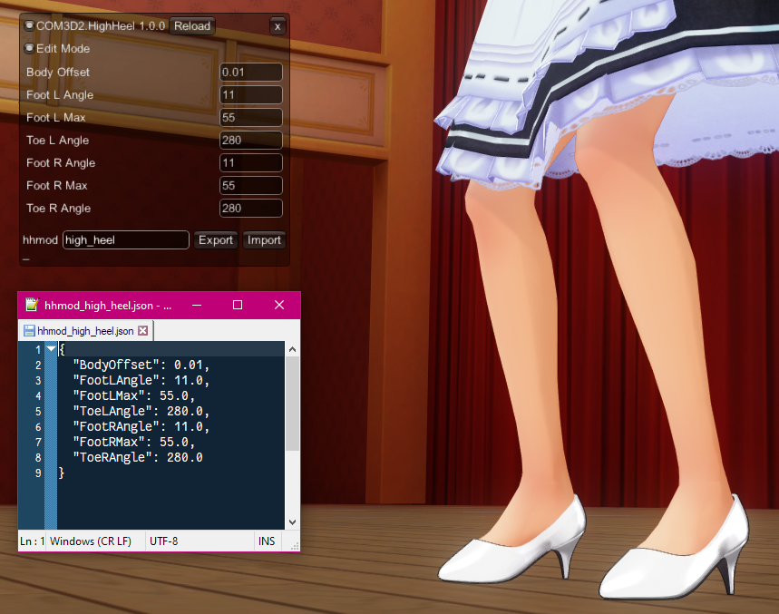
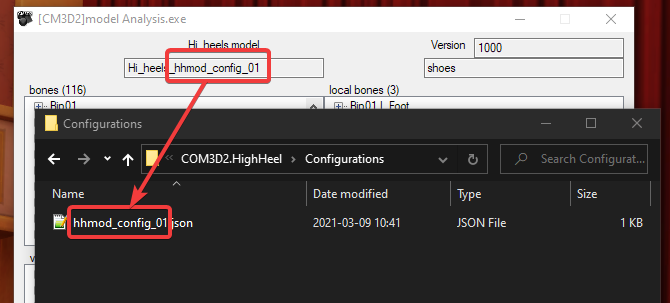

# COM3D2.HighHeel

Dynamically adjust maid's feet for high heels.

## Features

### A GUI editor to create high heel configurations for exporting

### Configuration association with model files

## Installation

Download latest release and extract contents of `BepInEx` into `COM3D2\BepInEx`
